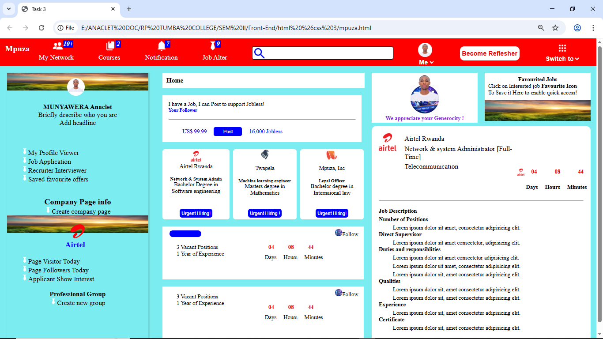

# HTML & CSS Task 3 - Web Page Layout

## Overview
This project is a **web page layout** designed to simulate a professional networking/job portal interface. It uses **HTML** and **CSS** TO Create company pages, job postings, notifications, and interactive elements.

### Header
- Displays **user info**, profile picture, and a dropdown for user options.
- Navigation menu with links:
  - My Network
  - Courses
  - Notifications
  - Job Alerts
- Search bar functionality
- Action buttons like **“Become Refresher”**.
- Notification counters for connections, courses, notifications, and jobs.

### User Profile Section
- Profile summary with image, name, headline, and brief description.
- Options to view profile, job applications, interviews, and saved offers.

### Company Section
- Company page info with a “Create Company Page” option.
- Example companies displayed with logos and hiring information.
- Job postings for positions like Network & System Admin, Machine Learning Engineer, Legal Officer.
- Urgent hiring notifications with countdown timers.

### Job Postings & Professional Groups
- Section for job postings with vacancy details, experience requirements, and follow options.
- Professional groups creation and management interface.

### Favorites Section
- Save favorited jobs for easy access.
- Highlights appreciated user actions and saved items.

## Technologies Used
- **HTML5** – For semantic page structure.
- **CSS3** – For styling and layout.
- Responsive design using `meta viewport`.

## Setup Instructions
1. Clone or download the repository.
2. Ensure all images used in the HTML are available in the correct folder (`images/`).
3. Open **mpuza.html** in a web browser to view the page.
4. Edit **mpuza.css** to customize styling as needed.

## Screenshots

## Notes
- This is a **static layout**; no backend functionality is implemented.
- JavaScript can be added later for dynamic behavior such as search, notifications, and job application interactions.

## Author
Names:**MUNYAWERA Anaclet**  
Reg Number: **25RP00508** 
Class: **IT Class A**
